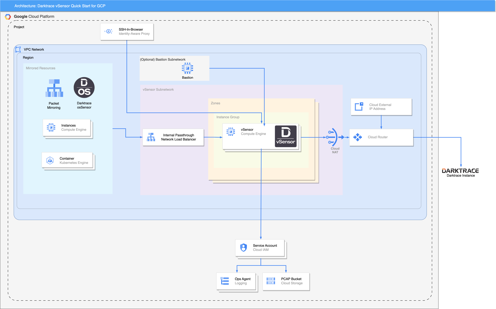

# Darktrace vSensor Quickstart for GCP

## Overview

This Quick Start deploys Darktrace vSensor virtual threat detection on Google Cloud Platform (GCP). For deploying on Amazon Web Services (AWS), see [terraform-aws-vsensor](https://github.com/darktrace/terraform-aws-vsensor).

Darktrace vSensors analyze raw packet data from mirrored virtual private cloud (VPC) traffic to learn to identify threats. This guide covers the steps necessary to deploy this Quick Start.

Darktrace vSensors accept traffic from mirroring subnets (GCP Virtual Private Cloud [Packet Mirroring](https://cloud.google.com/vpc/docs/packet-mirroring)) and from Darktrace osSensor agents.

- GCP Virtual Private Cloud (VPC) Packet Mirroring copies traffic from VPC subnets you want to monitor.
- Darktrace osSensors can be configured on virtual machines and containerized applications. Darktrace osSensors are available for Linux, Windows, and as a [container](https://github.com/darktrace/ossensor-container) for any system that can run the Docker Engine.

Darktrace vSensors can also be configured to accept syslog feeds of third-party security information and event management tools.

Darktrace vSensors perform deep packet inspection and extract meta-data from the traffic sources. This meta-data is then submitted to a connected Darktrace cloud service or physical Darktrace deployment over port 443 (TLS). PCAP (packet capture) data is also produced by the vSensor for forensic analysis. This is stored in a Google Cloud Storage bucket.

This guide covers the steps necessary to deploy this Quick Start.

## Architecture Diagram



This module sets up the following:

- A VPC (optional), or provide an existing VPC to deploy into
- A Subnet for containing the internal vSensors
- A Cloud Router to provide vSensors with appliance / update connectivity
- A Managed Instance Group containing vSensors with predictive autoscaling
- (Optional) A GCP Storage bucket for storing PCAPS for later analysis
- GCP IAP (SSH-in-Browser) ssh access to the vSensors
- IAM role assignments configuring GCP Ops Agent logging and (optionally) Storage bucket
- (Optional) A Bastion subnet, firewall rules and host for allowing external access to the vSensors
- (Optional) User and public ssh key for ssh public key authentication

## Deployment options

This Quick Start terraform module provides the following deployment options:

- Deploy Darktrace vSensor into an existing VPC. This option provisions Darktrace vSensor in your existing GCP infrastructure in a new subnet.
- Deploy Darktrace vSensor into a new VPC. This option builds a new GCP environment that consists of the VPC, subnet, Cloud NAT (Public), and other infrastructure components. It then deploys Darktrace vSensor into this new VPC.

## Pre deployment steps

### Register a push token and obtain a Darktrace vSensor update key.

Register a new push token to enable connection between vSensor probes and an existing Darktrace on-premise or cloud instance. All of the vSensor instances in one deployment should share the same push token.

 1. Log into the Darktrace console.

 2. From the main menu, choose Admin > System Config, then access the "Settings" page.

 3. Locate the "Push Probe Tokens" section. At the bottom of the list of probes is a field to create a new token. Enter a label for the vSensor deployment.

 4. Choose Add. You will need to record two variables from the resulting window. The vSensor Update Key (also found on the Darktrace customer portal) and the Push Token. The Push Token is only displayed once.

 5. In GCP Secret Manager create a new secret with a unique name eg. `darktrace_vsensor_update_key` and the value of the vSensor Update Key obtained previously.

 6. In GCP Secret Manager create a new secret with a unique name eg. `darktrace_push_token` and the value of the Push Token obtained previously. (Any additional Darktrace master deployments will require their own push token)

If you have a physical Darktrace deployment behind a firewall, you must grant access to the instance from the IP addresses of your NAT Gateways after deployment.

Note: Darktrace cloud offerings are already configured to allow Push Token access, no firewall changes are necessary.

### Set osSensor shared HMAC secret key

The shared HMAC secret key between the osSensor and vSensor is optional for the installation. If the HMAC is not provided the module will not set the osSensor shared HMAC secret key on the vSensors, such that osSensors can not connect.

 1. In GCP Secret Manager create a new secret with a unique name eg. `os_sensor_hmac_token` and the value of the osSensor shared HMAC secret key obtained previously.

### Enabled GCP APIs

The following GCP APIs are required for deploying this template:

- Compute Engine
- Cloud Deployment Manager v2
- Identity and Access Management (IAM)
- IAM Service Account Credentials
- Cloud Resource Manager
- Cloud Logging
- Cloud Monitoring
- Secret Manager

## Usage

### Before you start

When the module is used to create a new VPC for deploying the vSensors, there are still no subnets in that VPC for packet mirroring, hence the module cannot configure the packet mirroring. Once the terraform deployment has completed you can create the subnets for the instances that traffic will be mirrored. Then, you can either:
- configure the packet mirroring manually,
- provide the names of these subnets to the module (input variable `mirrored_subnets`) and run again `terraform apply` which will configure the packet mirroring; this way, the packet mirroring resource will be managed by the terraform module and you can use it to change the packet mirroring filter parameter (`mirrored_protocols`, `mirrored_cidr_ranges`, `mirrored_direction`).

The CIDR range for the subnet that the vSensors will be deployed in, should have enough usable IP addresses for the maximum vSensor instances (see `mig_max_size`) plus one for the Internal passthrough Network Load Balancer. Learn more about how [GCP uses the IP addresses in a subnet](https://cloud.google.com/vpc/docs/subnets#unusable-ip-addresses-in-every-subnet).

### Deploy Darktrace vSensor into an existing VPC

```
module "vsensors" {
  source = "git::https://github.com/darktrace/terraform-gcp-vsensor?ref=<version>"


  project_id = "XXXXXXX"
  region     = "europe-west1"

  deployment_prefix = "euw1a"

  existing_vpc_name = "XXXXXXX"
  mirrored_subnets  = ["XXXX-sub1", "XXXX-sub2"]

  mig_subnet_cidr = "10.127.2.128/27"

  sm_update_key        = "sm_test_update_key"
  sm_push_token        = "sm_test_push_token"
  sm_ossensor_hmac     = "sm_test_hmac_token"
  dt_instance_hostname = "dt-master.company.com"

}
```

### Deploy Darktrace vSensor into a new VPC

```
module "vsensors" {
  source = "git::https://github.com/darktrace/terraform-gcp-vsensor?ref=<version>"


  project_id = "XXXXXXX"
  region     = "europe-west1"

  deployment_prefix = "euw1a"

  new_vpc_enable = true

  mig_subnet_cidr = "10.127.2.128/27"

  sm_update_key        = "sm_test_update_key"
  sm_push_token        = "sm_test_push_token"
  sm_ossensor_hmac     = "sm_test_hmac_token"
  dt_instance_hostname = "dt-master.company.com"

}
```

## Requirements

| Name | Version |
|------|---------|
| <a name="requirement_terraform"></a> [terraform](#requirement\_terraform) | >= 1.4 |
| <a name="requirement_google"></a> [google](#requirement\_google) | >= 4.79 |
| <a name="requirement_google-beta"></a> [google-beta](#requirement\_google-beta) | >= 4.79 |
| <a name="requirement_random"></a> [random](#requirement\_random) | ~>3.5 |

## Providers

| Name | Version |
|------|---------|
| <a name="provider_google"></a> [google](#provider\_google) | >= 4.79 |
| <a name="provider_google-beta"></a> [google-beta](#provider\_google-beta) | >= 4.79 |
| <a name="provider_random"></a> [random](#provider\_random) | ~>3.5 |

## Modules

No modules.

## Resources

| Name | Type |
|------|------|
| [google-beta_google_compute_forwarding_rule.vsensor](https://registry.terraform.io/providers/hashicorp/google-beta/latest/docs/resources/google_compute_forwarding_rule) | resource |
| [google-beta_google_compute_region_autoscaler.vsensor](https://registry.terraform.io/providers/hashicorp/google-beta/latest/docs/resources/google_compute_region_autoscaler) | resource |
| [google-beta_google_compute_region_instance_group_manager.vsensor](https://registry.terraform.io/providers/hashicorp/google-beta/latest/docs/resources/google_compute_region_instance_group_manager) | resource |
| [google_compute_address.vsensor_bastion_external](https://registry.terraform.io/providers/hashicorp/google/latest/docs/resources/compute_address) | resource |
| [google_compute_address.vsensor_lb](https://registry.terraform.io/providers/hashicorp/google/latest/docs/resources/compute_address) | resource |
| [google_compute_address.vsensor_nat_external](https://registry.terraform.io/providers/hashicorp/google/latest/docs/resources/compute_address) | resource |
| [google_compute_firewall.traffic_mirror](https://registry.terraform.io/providers/hashicorp/google/latest/docs/resources/compute_firewall) | resource |
| [google_compute_firewall.traffic_mirror_ipv6](https://registry.terraform.io/providers/hashicorp/google/latest/docs/resources/compute_firewall) | resource |
| [google_compute_firewall.vsensor_bastion_fw](https://registry.terraform.io/providers/hashicorp/google/latest/docs/resources/compute_firewall) | resource |
| [google_compute_health_check.vsensor](https://registry.terraform.io/providers/hashicorp/google/latest/docs/resources/compute_health_check) | resource |
| [google_compute_instance_from_template.vsensor_bastion_vm](https://registry.terraform.io/providers/hashicorp/google/latest/docs/resources/compute_instance_from_template) | resource |
| [google_compute_instance_template.vsensor](https://registry.terraform.io/providers/hashicorp/google/latest/docs/resources/compute_instance_template) | resource |
| [google_compute_instance_template.vsensor_bastion](https://registry.terraform.io/providers/hashicorp/google/latest/docs/resources/compute_instance_template) | resource |
| [google_compute_network.vsensor](https://registry.terraform.io/providers/hashicorp/google/latest/docs/resources/compute_network) | resource |
| [google_compute_packet_mirroring.vsensor](https://registry.terraform.io/providers/hashicorp/google/latest/docs/resources/compute_packet_mirroring) | resource |
| [google_compute_region_backend_service.vsensor](https://registry.terraform.io/providers/hashicorp/google/latest/docs/resources/compute_region_backend_service) | resource |
| [google_compute_route.ipv6_default_route](https://registry.terraform.io/providers/hashicorp/google/latest/docs/resources/compute_route) | resource |
| [google_compute_router.vsensor](https://registry.terraform.io/providers/hashicorp/google/latest/docs/resources/compute_router) | resource |
| [google_compute_router_nat.vsensor](https://registry.terraform.io/providers/hashicorp/google/latest/docs/resources/compute_router_nat) | resource |
| [google_compute_subnetwork.vsensor](https://registry.terraform.io/providers/hashicorp/google/latest/docs/resources/compute_subnetwork) | resource |
| [google_compute_subnetwork.vsensor_bastion](https://registry.terraform.io/providers/hashicorp/google/latest/docs/resources/compute_subnetwork) | resource |
| [google_project_iam_member.vsensor](https://registry.terraform.io/providers/hashicorp/google/latest/docs/resources/project_iam_member) | resource |
| [google_project_iam_member.vsensor-hmac](https://registry.terraform.io/providers/hashicorp/google/latest/docs/resources/project_iam_member) | resource |
| [google_project_iam_member.vsensor_bastion_log](https://registry.terraform.io/providers/hashicorp/google/latest/docs/resources/project_iam_member) | resource |
| [google_project_iam_member.vsensor_bastion_mon](https://registry.terraform.io/providers/hashicorp/google/latest/docs/resources/project_iam_member) | resource |
| [google_secret_manager_secret_iam_member.sm_ossensor_hmac](https://registry.terraform.io/providers/hashicorp/google/latest/docs/resources/secret_manager_secret_iam_member) | resource |
| [google_secret_manager_secret_iam_member.sm_push_token](https://registry.terraform.io/providers/hashicorp/google/latest/docs/resources/secret_manager_secret_iam_member) | resource |
| [google_secret_manager_secret_iam_member.update_key](https://registry.terraform.io/providers/hashicorp/google/latest/docs/resources/secret_manager_secret_iam_member) | resource |
| [google_service_account.vsensor](https://registry.terraform.io/providers/hashicorp/google/latest/docs/resources/service_account) | resource |
| [google_service_account.vsensor_bastion](https://registry.terraform.io/providers/hashicorp/google/latest/docs/resources/service_account) | resource |
| [google_storage_bucket.vsensor_pcaps](https://registry.terraform.io/providers/hashicorp/google/latest/docs/resources/storage_bucket) | resource |
| [google_storage_bucket_iam_member.legacy_bucket_owner_po](https://registry.terraform.io/providers/hashicorp/google/latest/docs/resources/storage_bucket_iam_member) | resource |
| [google_storage_bucket_iam_member.legacy_bucket_reader_sa](https://registry.terraform.io/providers/hashicorp/google/latest/docs/resources/storage_bucket_iam_member) | resource |
| [google_storage_bucket_iam_member.object_admin_po](https://registry.terraform.io/providers/hashicorp/google/latest/docs/resources/storage_bucket_iam_member) | resource |
| [google_storage_bucket_iam_member.object_admin_sa](https://registry.terraform.io/providers/hashicorp/google/latest/docs/resources/storage_bucket_iam_member) | resource |
| [random_string.rnd_deploy_id](https://registry.terraform.io/providers/hashicorp/random/latest/docs/resources/string) | resource |
| [google_compute_network.default](https://registry.terraform.io/providers/hashicorp/google/latest/docs/data-sources/compute_network) | data source |
| [google_compute_zones.available](https://registry.terraform.io/providers/hashicorp/google/latest/docs/data-sources/compute_zones) | data source |
| [google_project.project](https://registry.terraform.io/providers/hashicorp/google/latest/docs/data-sources/project) | data source |
| [google_secret_manager_secret.ossensor_hmac](https://registry.terraform.io/providers/hashicorp/google/latest/docs/data-sources/secret_manager_secret) | data source |
| [google_secret_manager_secret.push_token](https://registry.terraform.io/providers/hashicorp/google/latest/docs/data-sources/secret_manager_secret) | data source |
| [google_secret_manager_secret.update_key](https://registry.terraform.io/providers/hashicorp/google/latest/docs/data-sources/secret_manager_secret) | data source |

## Inputs

| Name | Description | Type | Default | Required |
|------|-------------|------|---------|:--------:|
| <a name="input_bastion_enable"></a> [bastion\_enable](#input\_bastion\_enable) | (Optional; applicable only if `new_vpc_enable = true`) If true a standalone/single bastion host will be installed to provide ssh remote access to the vSensors.<br/>  A new subnet will be created for the bastion. | `bool` | `false` | no |
| <a name="input_bastion_ssh_cidr"></a> [bastion\_ssh\_cidr](#input\_bastion\_ssh\_cidr) | (Optional) List of Subnet CIDR ranges that the Bastion will accept SSH from. Add 35.235.240.0/20 to the list to enable GCP IAP (SSH-in-Browser) ssh access to the Bastion. Do not provide any value if bastion is not enabled. | `list(string)` | `[]` | no |
| <a name="input_bastion_ssh_user_key"></a> [bastion\_ssh\_user\_key](#input\_bastion\_ssh\_user\_key) | (Optional) Bastion username and public ssh key for ssh public key authentication in format 'username:ssh\_public\_key'.<br/>  This will be added to the instance metadata: https://cloud.google.com/compute/docs/connect/add-ssh-keys#add_ssh_keys_to_instance_metadata.<br/>  Example: `bastion_ssh_user_key = "test:ssh-ed25519 AAAAC3NzaC1lZDI1NTE5AAAAILg6UtHDNyMNAh0GjaytsJdrUxjtLy3APXqZfNZhvCeT test"` | `string` | `null` | no |
| <a name="input_bastion_subnet_cidr"></a> [bastion\_subnet\_cidr](#input\_bastion\_subnet\_cidr) | (Optional) Subnet CIDR range that the Bastion will be deployed in (must not overlap with vSensor or other subnets in the VPC). Example: 10.127.2.0/27. Do not provide any value if bastion is not enabled. | `string` | `null` | no |
| <a name="input_deployment_prefix"></a> [deployment\_prefix](#input\_deployment\_prefix) | The name of the deployment and VM instance.<br/>  A string that will be used to create deployment ID and resource names. It can contain between two and five lowercase alphabet characters and digits.<br/>  It must start with lowercase alphabet character." | `string` | n/a | yes |
| <a name="input_dt_instance_hostname"></a> [dt\_instance\_hostname](#input\_dt\_instance\_hostname) | Host name of the Darktrace Master instance. | `string` | n/a | yes |
| <a name="input_dt_instance_port"></a> [dt\_instance\_port](#input\_dt\_instance\_port) | Connection port between vSensor and the Darktrace Master instance. | `number` | `443` | no |
| <a name="input_existing_vpc_name"></a> [existing\_vpc\_name](#input\_existing\_vpc\_name) | The existing VPC network name where the vSensors will be deployed. If `new_vpc_enable = true` this will be ignored. | `string` | `""` | no |
| <a name="input_ipv6_enable"></a> [ipv6\_enable](#input\_ipv6\_enable) | Enable Dual-Stack IPv6 support to vSensor for allowing packet mirroring from IPv6 enabled hosts/subnets. | `bool` | `false` | no |
| <a name="input_mig_instance_type"></a> [mig\_instance\_type](#input\_mig\_instance\_type) | The machine type to use to create the vSensor. Sizing requirements can be found at https://customerportal.darktrace.com/product-guides/main/vsensor-requirements. | `string` | `"e2-standard-2"` | no |
| <a name="input_mig_max_size"></a> [mig\_max\_size](#input\_mig\_max\_size) | Maximum number of vSensor instances in the Autoscaling group. It is recommended to be set larger than the `mig_min_size` to allow Autoscaling and instance replacement actions to work correctly. | `number` | `3` | no |
| <a name="input_mig_min_size"></a> [mig\_min\_size](#input\_mig\_min\_size) | Minimum number of vSensor instances in the Autoscaling group. | `number` | `2` | no |
| <a name="input_mig_ssh_user_key"></a> [mig\_ssh\_user\_key](#input\_mig\_ssh\_user\_key) | vSensor username and public ssh key for ssh public key authentication in format 'username:ssh\_public\_key'.<br/>  This will be added to the instance metadata: https://cloud.google.com/compute/docs/connect/add-ssh-keys#add_ssh_keys_to_instance_metadata.<br/>  Example: `mig_ssh_user_key = "test:ssh-ed25519 AAAAC3NzaC1lZDI1NTE5AAAAILg6UtHDNyMNAh0GjaytsJdrUxjtLy3APXqZfNZhvCeT test"` | `string` | `null` | no |
| <a name="input_mig_subnet_cidr"></a> [mig\_subnet\_cidr](#input\_mig\_subnet\_cidr) | Subnet range that the vSensors will be deployed in (must not overlap with bastion or other subnets in VPC). | `string` | n/a | yes |
| <a name="input_mig_zone"></a> [mig\_zone](#input\_mig\_zone) | The distribution policy for the vSensors managed instance group.<br/>  You can specify one or more values, for example ["europe-west1-b", "europe-west1-c"].<br/>  The default (empty) means **all zones** in the region. | `list(string)` | `[]` | no |
| <a name="input_mirrored_cidr_ranges"></a> [mirrored\_cidr\_ranges](#input\_mirrored\_cidr\_ranges) | IP CIDR ranges that apply as a filter on the source (ingress) or destination (egress) IP in the IP header.<br/>  IPv4 and IPv6 are supported (requires `ipv6-enable`).<br/>  Use 0.0.0.0/0, ::/0 to allow all IPv4 and IPv6 ranges.<br/>  Example: ["10.0.0.0/24", "10.0.1.0/24"].<br/>  The default value is "0.0.0.0/0". | `list(string)` | <pre>[<br/>  "0.0.0.0/0",<br/>  "::/0"<br/>]</pre> | no |
| <a name="input_mirrored_direction"></a> [mirrored\_direction](#input\_mirrored\_direction) | Direction of traffic to mirror.<br/>  Possible values are: INGRESS, EGRESS, BOTH. NOTE: any setting other than BOTH may lead to unidirectional traffic alerts on the Darktrace master instance.<br/>  The default value is BOTH. | `string` | `"BOTH"` | no |
| <a name="input_mirrored_protocols"></a> [mirrored\_protocols](#input\_mirrored\_protocols) | (Optional). IP protocols to mirror.<br/>  Possible IP protocols including ah, esp, icmp, ipip, sctp, tcp, udp, or an IP protocol number between 0 and 255.<br/>  Example: ["tcp", "udp"] to mirror only tcp and udp protocols.<br/>  Do not provide any value to mirror all IP protocols.<br/>  The default is to mirror all IP protocols.<br/>  Changing the value will force resource replacement (destroy and then create replacement). | `list(string)` | `[]` | no |
| <a name="input_mirrored_subnets"></a> [mirrored\_subnets](#input\_mirrored\_subnets) | (Optional) Names of the subnets to be mirrored. For example ["mirror-subnet-1", "mirror-subnet-2"].<br/>  If left empty, no packet mirroring policy will be created.<br/>  In such cases, packet mirroring policy can be manually created later, or once the module has completed, mirrored\_subnets can be added and another `terraform apply` will create the policy. | `list(string)` | `[]` | no |
| <a name="input_new_vpc_enable"></a> [new\_vpc\_enable](#input\_new\_vpc\_enable) | If `true` will create a new VPC network. The name of the new network will be of the form `deployment_prefix-<random-string>-`. | `bool` | `false` | no |
| <a name="input_project_id"></a> [project\_id](#input\_project\_id) | Project ID. | `string` | n/a | yes |
| <a name="input_region"></a> [region](#input\_region) | The region that the resources will be deployed into. | `string` | n/a | yes |
| <a name="input_retention_time_days"></a> [retention\_time\_days](#input\_retention\_time\_days) | Number of days to retain captured packets in the bucket. Longer retention will increase storage costs. Set to 0 to disable PCAPs and Storage bucket. | `number` | `7` | no |
| <a name="input_sm_ossensor_hmac"></a> [sm\_ossensor\_hmac](#input\_sm\_ossensor\_hmac) | (Optional)Secret Manager Secret Name of the hash-based message authentication code (HMAC) token to authenticate osSensors with vSensor. | `string` | `""` | no |
| <a name="input_sm_push_token"></a> [sm\_push\_token](#input\_sm\_push\_token) | Secret Manager Secret Name of the push token. The push token is used to authenticate the vSensor with the Darktrace Master instance. | `string` | n/a | yes |
| <a name="input_sm_update_key"></a> [sm\_update\_key](#input\_sm\_update\_key) | Secret Manager Secret Name of the vSensor update key. If you don't have one, contact your Darktrace representative. | `string` | n/a | yes |
| <a name="input_ssh_iap"></a> [ssh\_iap](#input\_ssh\_iap) | (Forces re-creating the vSensor) Enable or disable GCP IAP (SSH-in-Browser) ssh access to the vSensors. Accepted values are enable or disable. The default is enable. After the vSensors have been deployed, changing the value will force re-creating the vSensors in the **create before destroy** fashion. | `string` | `"enable"` | no |

## Outputs

| Name | Description |
|------|-------------|
| <a name="output_bastion_external_ip"></a> [bastion\_external\_ip](#output\_bastion\_external\_ip) | Public IP address used for the Bastion VM. |
| <a name="output_lb_ip"></a> [lb\_ip](#output\_lb\_ip) | LB fronend IP. |
| <a name="output_mig_distribution_zones"></a> [mig\_distribution\_zones](#output\_mig\_distribution\_zones) | Zones configured for vSensors managed instance group (MIG). |
| <a name="output_mig_subnets_id"></a> [mig\_subnets\_id](#output\_mig\_subnets\_id) | Subnet id where the vSensors are deployed. |
| <a name="output_mirrored_protocols"></a> [mirrored\_protocols](#output\_mirrored\_protocols) | List of the packet mirroring protocols. |
| <a name="output_nat_external_ip"></a> [nat\_external\_ip](#output\_nat\_external\_ip) | Public IP address used for NAT router to allow vSensors access to Darktrace cloud service / physical Darktrace deployment and software updates. |
| <a name="output_pcaps_bucket_name"></a> [pcaps\_bucket\_name](#output\_pcaps\_bucket\_name) | The name of the bucket that stores the PCAPs. |
| <a name="output_pcaps_bucket_self_link"></a> [pcaps\_bucket\_self\_link](#output\_pcaps\_bucket\_self\_link) | The URI of the bucket that stores the PCAPs. |
| <a name="output_pcaps_bucket_url"></a> [pcaps\_bucket\_url](#output\_pcaps\_bucket\_url) | The  base URL of the bucket that stores the PCAPs. |
| <a name="output_project_id"></a> [project\_id](#output\_project\_id) | The project id. |
| <a name="output_project_number"></a> [project\_number](#output\_project\_number) | The project number. |
| <a name="output_service_account_vsensor_email"></a> [service\_account\_vsensor\_email](#output\_service\_account\_vsensor\_email) | The service account email. |
| <a name="output_vpc_id"></a> [vpc\_id](#output\_vpc\_id) | The ID of the new VPC. |
| <a name="output_vpc_name"></a> [vpc\_name](#output\_vpc\_name) | The name of the new VPC. |
| <a name="output_vpc_self_link"></a> [vpc\_self\_link](#output\_vpc\_self\_link) | The self\_link of the new VPC. |

## Post deployment steps

### Configure networking

If you have a physical Darktrace deployment behind a firewall, you must grant access to the instance to the NAT router public IP addresses (`output_nat_external_ip`).

### Configure Packet mirroring

If `mirrored_subnets` was left empty, no Packet Mirroring Policy will be created. The module allows this to be configured post-deployment:
- Provide the names of the subnets to be mirrored (input variable `mirrored_subnets`);
- Run `terraform apply` again;

Alternatively, this can be configured manually from the GCP console.

### Configure osSensor shared HMAC secret key

The shared HMAC secret key between the osSensor and vSensor is optional for the installation. If the HMAC is not provided the module will not set the osSensor shared HMAC secret key on the vSensors.

Later, the deployment might require setting the HMAC on the vSensors. In that case:
- Configure the `sm_ossensor_hmac` with the  [HMAC secret key](#set-ossensor-shared-hmac-secret-key);
- Run `terraform apply` again;

Be aware, that the above will force vSensors replacement and some downtime is expected. It is advised that such changes are planned for a Maintenance Window.

### Troubleshooting

In scenarios of invalid configuration parameters, upstream internet access blocked and other cases of the VM instances failing to install and configure Darktrace vSensor, the Managed Instance Group will fail to deploy.

In most situations, logging will be available from the vSensor start up in "Logs Explorer". In "LOG NAME" look for `vsensor-userdata`.

If no userdata logging is provided in "Logs Explorer", you may need to connect directly to the vSensor via GCP IAP (SSH-in-Browser) or ssh from a Bastion and retrieve /var/log/user-data.log directly.

For situations where the error is not clear, contact Darktrace Customer Support via the [Darktrace Customer Portal](https://customerportal.darktrace.com/), provide the terraform error and one of the above userdata logs if available.

### Configuration changes

#### Change the packet mirroring filter

If Packet mirroring was configured via Terraform, changes in the packet mirroring filter, for example the `mirrored_protocols`, will replace the resource `google_compute_packet_mirroring` in a 'destroy and then create replacement' manner. You will encounter a short downtime and it is advised that such changes are planned for a Maintenance Window.

### Logging / Metrics

Google Ops Agent is configured on the vSensors and bastion automatically to provide more detailed statistics including CPU, memory and bandwidth.

It also provides [Log Explorer](https://console.cloud.google.com/logs/) logs in four 'Log Name' groups to support debugging:

- `vsensor-syslog` For general syslog logging.
- `vsensor-updates` For logging from `apt`/`dpkg` package updating of the vSensor and OS packages.
- `vsensor-services` For logging from the main vSensor product components.
- `vsensor-userdata` For logging from the initial vSensor installation.

### Multiple Regions or projects

The module uses regional resources.

Each new deployment into a new region or GCP project should be given a new push token generated from the master instance UI config page. Each push token refers to a scalable set of vSensors, which share the same Cloud Storage bucket and config. When querying for pcap data, the master instance only queries one vSensor in the probe group (to avoid querying the same Cloud Storage bucket multiple times). If the same push token is reused in multiple environments, querying for PCAP data will only search one of the environments and miss the rest.
